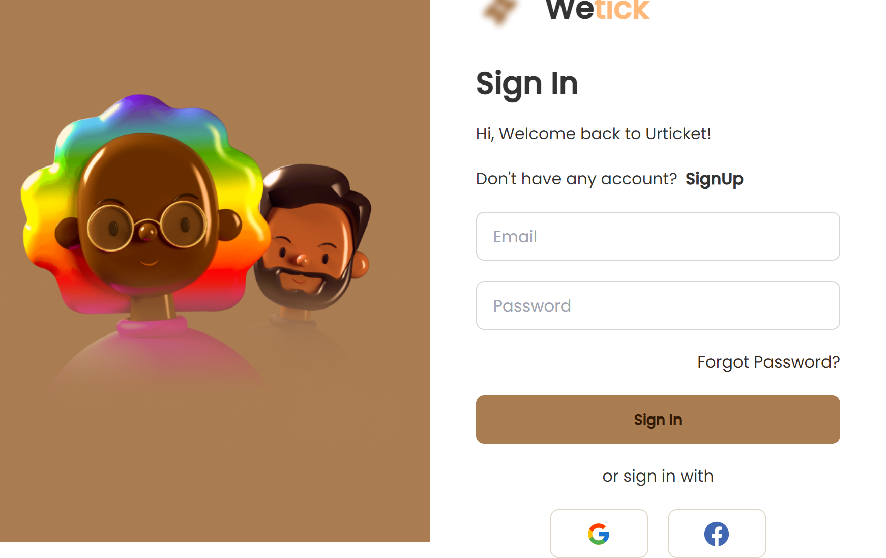
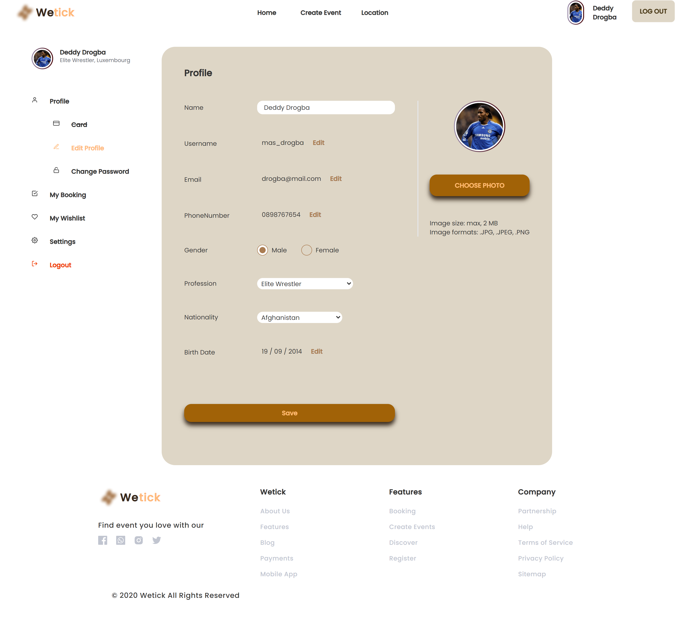

# Display

<table>
  <tr>
    <td valign="top">Login Page</td>
    <td valign="top">Home Page</td>
    <td valign="top">Profile Page</td>
    <td valign="top">Search Event Page</td>
  </tr>
</table>

# About The Project

Website for Reservation tickets and Create Events

# Feature

- Up-to-date and reliable Events Organizing
- Reservation events and create events
- And more

# Built with

- [Frontend]()
1. [ReactJS](https://reactnative.dev/)

- [Backend]()
1. [Node js](https://nodejs.org/en/)
2. [Express js](https://expressjs.com/en/starter/installing.html)

# Technologies
- [Redux](https://redux.js.org/)
- [Axios](https://axios-http.com/docs/intro)
- [Argon](https://www.npmjs.com/package/argon2)
- [jwt token](https://www.npmjs.com/package/jsonwebtoken)
- [Multer](https://www.npmjs.com/package/multer)
- [Moment](https://momentjs.com/)
- [Formik](https://formik.org/)


# How to use (Locally)

## 1. Clone the project

```bash
  git clone https://github.com/arthuriski29/fw15-frontend
```

## 2. Go to the project directory

```bash
  cd fw15-frontend
```

## 3. Install dependencies

```bash
  npm install
```

## 5. Start debugging and it will automatically installed debug in your phone

```bash
  npm run dev
```
run it in your browser :)
